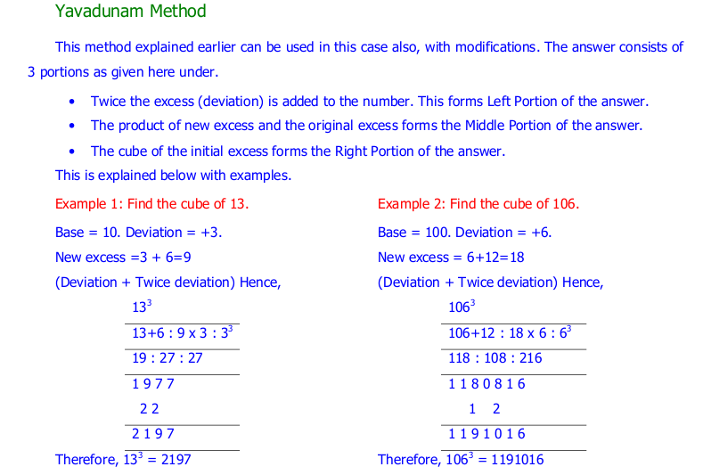
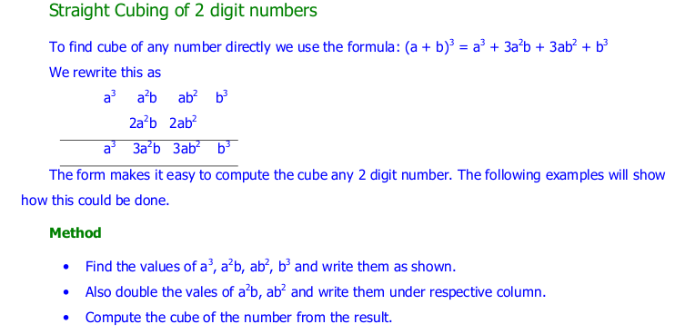
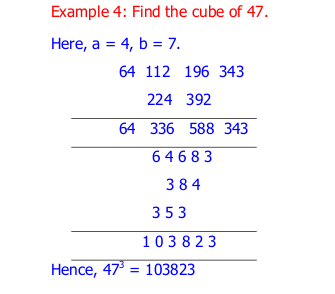

============
Cube
============

1) cube_a_number_near_powerof10
---------------------------------

**Implementation:**

.. code-block:: python

    import vedicpy as vedic

    a= vedic.cube.cube_a_number_near_powerof10(103)
    print(a)

>>> 1092727

2) cube_2digit_number
---------------------------------

**Implementation:**

.. code-block:: python

    import vedicpy as vedic

    a= vedic.cube.cube_2digit_number(37)
    print(a)

>>> 50653

