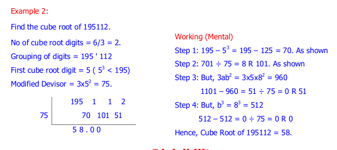

.. _cuberoot:

============
CubeRoot
============

1) isACube
---------------------------------

Let’s define something called a `Digital root <https://en.wikipedia.org/wiki/Digital_root>`_. 

It is the sum obtained after iteratively adding the digits of a number, till a single digit remains.

For example, 

- For 345, digital root of 345 => 3 + 4 + 5 =12. Now, 12 => 1+2 = 3.12=1+2=3. So, digital root of 345 = 3.

- For 12345678, digital root is 1+2+3+4+5+6+7+8 = 36. Now, 3+6 = 9. So, digital root of 12345678 = 9.

Turns out that for all perfect cubes, the digital root will either be 1,8,9. 0 is not included as 0 is a perfect cube of itself. 

Anyways, if for a number xx you get a digital root that is not 1,8,9 you can confidently say that xx is NOT a perfect cube.

**If the digital root is 1, 8, 9, 0 the number may or may not be a perfect cube.**

**Implementation:**
 
.. code-block:: python

    import vedicpy as vedic

    a= vedic.cuberoot.isACube(123)
    print(a)
    print(type(a))
    
    # Output
    >>> False
    >>> <class 'bool'>

This function returns a ``boolean`` value.

2) cuberoot_under_a_million
---------------------------------

**Implementation:**

.. code-block:: python

    import vedicpy as vedic

    a= vedic.cuberoot.cuberoot_under_a_million(175616)
    print(a)
    
    # Output
    >>> 56

`Vedic Mathematics doesn't provide a way to cube root accurately. So, if it says that the number is a perfect cube there is still some chance that it is not.`

3) cuberoot_under_thousand
---------------------------------

**Implementation:**

.. code-block:: python

    import vedicpy as vedic

    a= vedic.cuberoot.cuberoot_under_thousand(275)
    print(a)
    
    # Output
    >>> 6.5463
