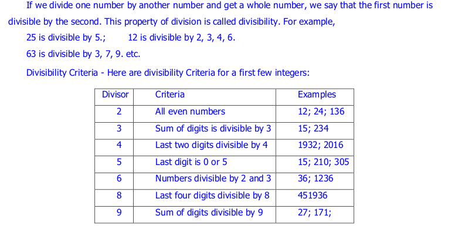

=================
Divisibility
=================

1) divisibility_under10
---------------------------------

**Implementation:**

.. code-block:: python

    import vedicpy as vedic

    # divisibility_under10() function takes two arguments,
    # first one is dividend and the other one is divisor
    vedic.divisibility.divisibility_under10(108, 9)

>>> The number is divisible.

*The function doesn't return any value.*

**The divisibility test is only applicable for divisor less than 10 excluding 1 and 7.**
