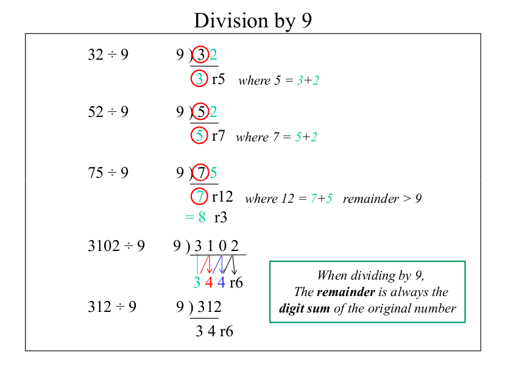

=================
Division
=================

1) division_by9
---------------------------------

**Implementation:**

.. code-block:: python

    import vedicpy as vedic

    # division_by9() function takes a single argument that is divident.
    vedic.division.division_by9(110)

>>> The quotent is: 12
>>> The reminder is: 2

*The function doesn't return any value.*

