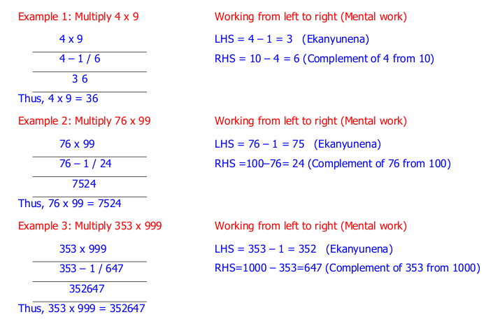
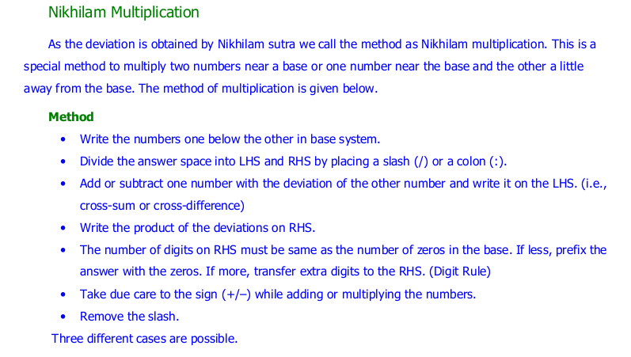
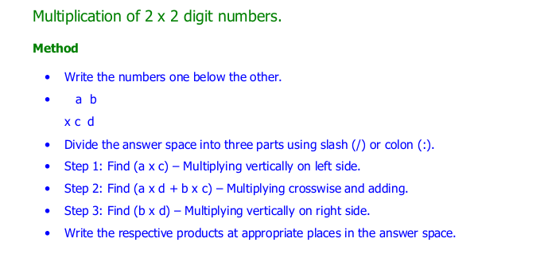
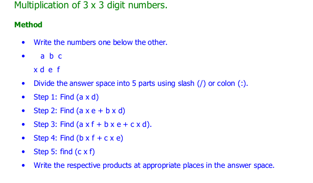
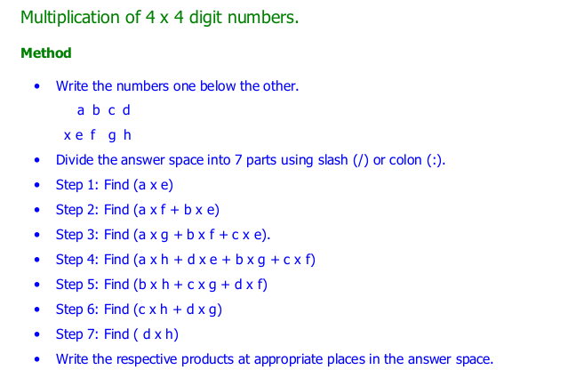
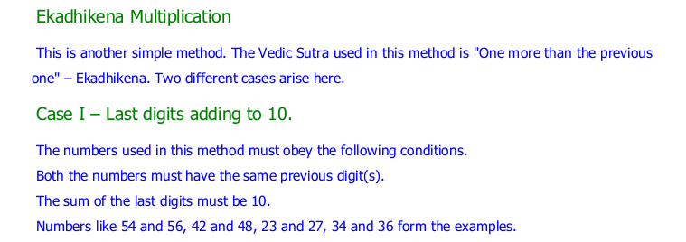
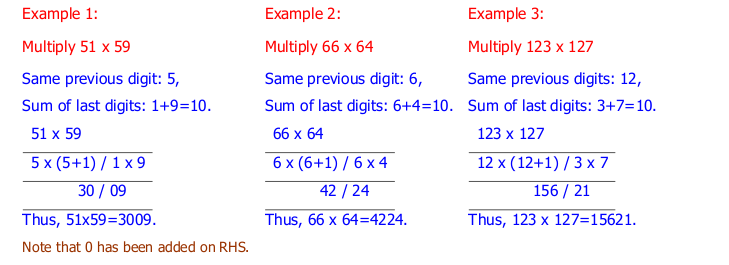
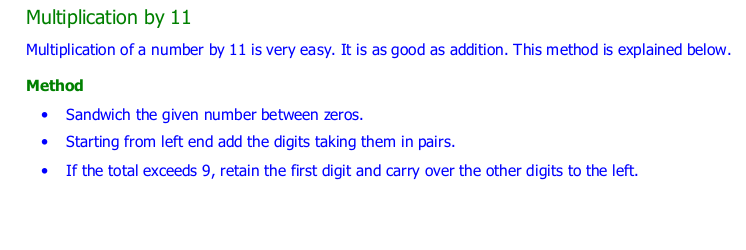
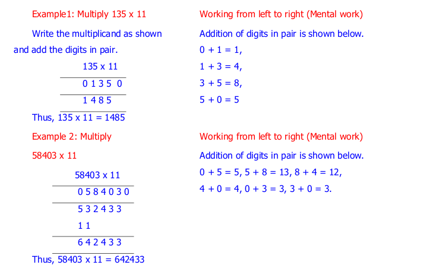
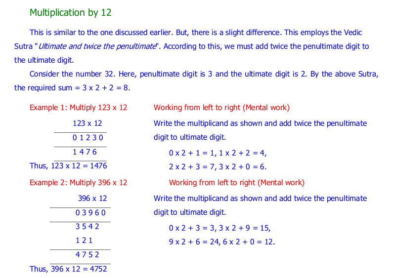

====================
Multiplication
====================

1) multiply_by_9group
---------------------------------

**Implementation:**

.. code-block:: python

    import vedicpy as vedic

    a= vedic.multiply.multiply_by_9group(234)
    print(a)

>>> 233766

2) multiply_base_near_powerof10
---------------------------------

.. image:: screenshot/power_10_2.png
    :alt: Near power of 10

**Implementation:**

.. code-block:: python

    import vedicpy as vedic

    a= vedic.multiply.multiply_base_near_powerof10(109,91)
    print(a)

>>> 9919

3) multiply_equdigit_number
---------------------------------

**Implementation:**

.. code-block:: python

    import vedicpy as vedic

    a= vedic.multiply.multiply_equdigit_number(1234, 4567)
    print(a)

>>> 5635678

4) multiply_lastdigit_sumto10
---------------------------------

**Implementation:**

.. code-block:: python

    import vedicpy as vedic

    a= vedic.multiply.multiply_lastdigit_sumto10(24, 26)
    print(a)

>>> 624

5) multiply_by11
---------------------------------

**Implementation:**

.. code-block:: python

    import vedicpy as vedic

    a= vedic.multiply.multiply_by11(103)
    print(a)

>>> 1133

6) multiply_by12
---------------------------------

**Implementation:**

.. code-block:: python

    import vedicpy as vedic

    a= vedic.multiply.multiply_by12(103)
    print(a)

>>> 1236

7) multiply_by13
----------------------------

**Implementation:**

.. code-block:: python

    import vedicpy as vedic

    a= vedic.multiply.multiply_by13(103)
    print(a)

>>> 1339

8) multiply_by14
----------------------------

**Implementation:**

.. code-block:: python

    import vedicpy as vedic

    a= vedic.multiply.multiply_by14(103)
    print(a)

>>> 1442

9) multiply_by15
----------------------------

**Implementation:**

.. code-block:: python

    import vedicpy as vedic

    a= vedic.multiply.multiply_by15(103)
    print(a)

>>> 1545

10) multiply_by16
----------------------------

**Implementation:**

.. code-block:: python

    import vedicpy as vedic

    a= vedic.multiply.multiply_by16(103)
    print(a)

>>> 1648

11) multiply_by17
----------------------------

**Implementation:**

.. code-block:: python

    import vedicpy as vedic

    a= vedic.multiply.multiply_by17(103)
    print(a)

>>> 1751

12) multiply_by18
----------------------------

**Implementation:**

.. code-block:: python

    import vedicpy as vedic

    a= vedic.multiply.multiply_by18(103)
    print(a)

>>> 1854

13) multiply_by19
----------------------------

**Implementation:**

.. code-block:: python

    import vedicpy as vedic

    a= vedic.multiply.multiply_by19(103)
    print(a)

>>> 1957

