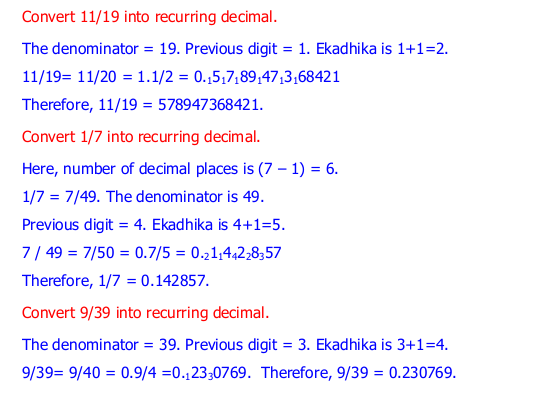

.. _recurring:

=================
Recurring
=================

1) recuring_fractionto_decimal
---------------------------------

.. image:: screenshot/recurring_1.png
   :alt: Recurring numbers

**Implementation:**

.. code-block:: python

    import vedicpy as vedic
    
    result = vedic.recurring.recuring_fractionto_decimal(11, 19)
    print(result)

>>> 0.578947

**The functions returns a decimal value with a round off on 6 digits.**
