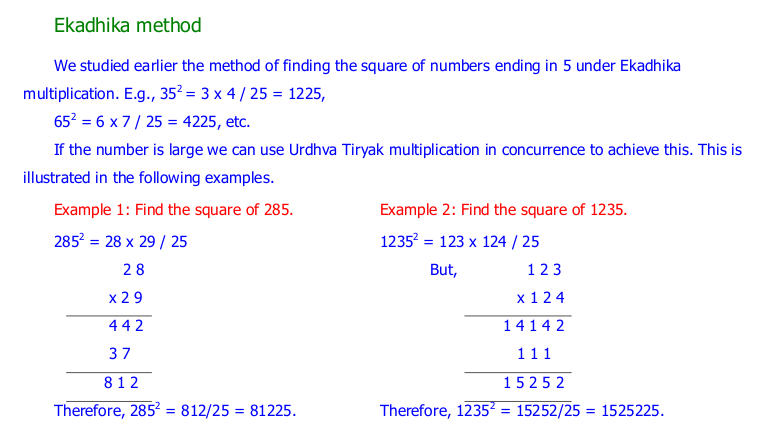
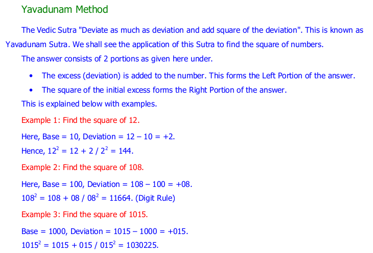
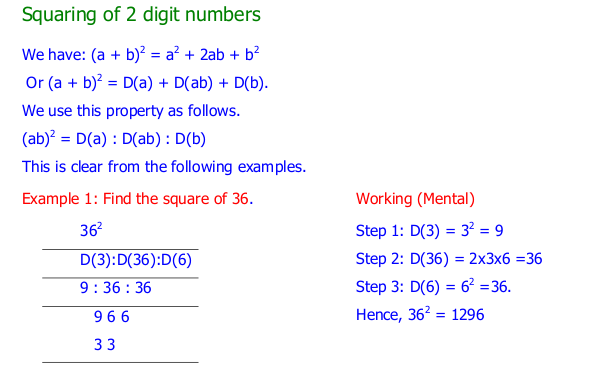
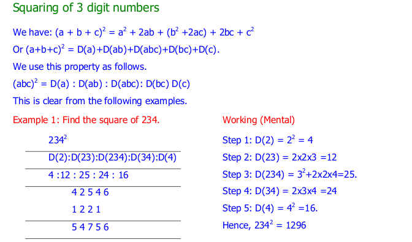

.. _square:

============
Square
============

1) square_ending5
---------------------------------

**Implementation:**

.. code-block:: python

    import vedicpy as vedic

    a= vedic.square.square_ending5(35)
    print(a)

>>> 1225

2) square_near_powerof10
---------------------------------

**Implementation:**

.. code-block:: python

    import vedicpy as vedic

    a= vedic.square.square_near_powerof10(98)
    print(a)

>>> 9604

3) square_under100
---------------------------------

**Implementation:**

.. code-block:: python

    import vedicpy as vedic

    a= vedic.square.square_under100(69)
    print(a)

>>> 4761

4) square_from100_to1000
---------------------------------

**Implementation:**

.. code-block:: python

    import vedicpy as vedic

    a= vedic.square.square_from100_to1000(983)
    print(a)

>>> 966289
