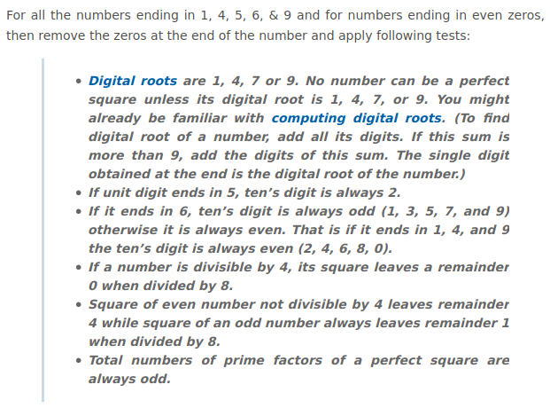
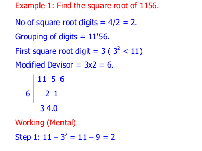

.. _squareroot:

============
Squareroot
============

1) isASquare
---------------------------------

If the number passes all the parameter then it **can** be a perfect square.

**Implementation:**

.. code-block:: python

    import vedicpy as vedic

    a= vedic.squareroot.isASquare(144)
    print(a)
    print(type(a))

>>> True
>>> <class 'bool'>

This function returns a ``boolean`` value.

2) perfect_sqrt_under_sqof100
---------------------------------

.. image:: screenshot/squareroot_2.png
   :alt: squareroot example

**Implementation:**

.. code-block:: python

    import vedicpy as vedic

    a= vedic.squareroot.perfect_sqrt_under_sqof100(144)
    print(a)

>>> 12

`Vedic Mathematics doesn't provide a way to square root accurately. So, if it says that the number is a perfect square there is still some chance that it is not.`

